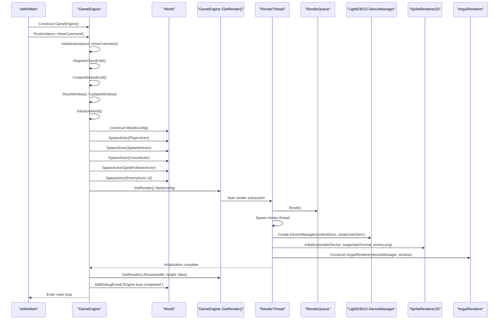
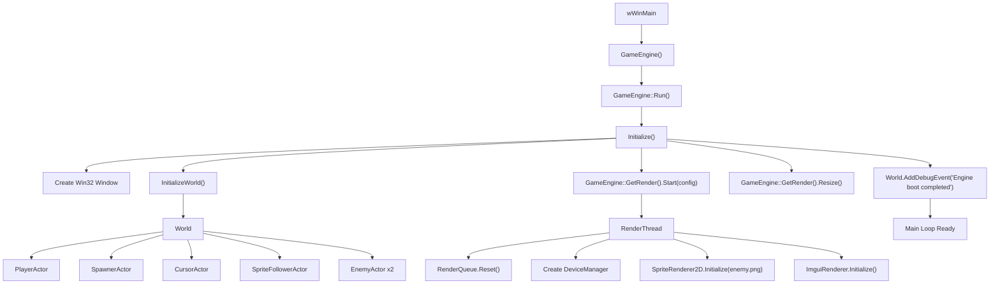

# MiniEngine2D Initialization UML

```mermaid
sequenceDiagram
    participant Main as "wWinMain"
    participant GE as "GameEngine"
    participant W as "World"
    participant GR as "GameEngine::GetRender()"
    participant RT as "RenderThread"
    participant RQ as "RenderQueue"
    participant RD as "LightD3D12 DeviceManager"
    participant SR as "SpriteRenderer2D"
    participant IG as "ImguiRenderer"

    Main->>GE: Construct GameEngine()
    Main->>GE: Run(instance, showCommand)

    GE->>GE: Initialize(instance, showCommand)
    GE->>GE: RegisterClassExW()
    GE->>GE: CreateWindowExW()
    GE->>GE: ShowWindow() / UpdateWindow()

    GE->>GE: InitializeWorld()
    GE->>W: Construct World(config)
    GE->>W: SpawnActor(PlayerActor)
    GE->>W: SpawnActor(SpawnerActor)
    GE->>W: SpawnActor(CursorActor)
    GE->>W: SpawnActor(SpriteFollowerActor)
    GE->>W: SpawnActor(EnemyActor x2)

    GE->>GR: GetRender().Start(config)
    GR->>RT: Start render subsystem
    RT->>RQ: Reset()
    RT->>RT: Spawn render thread

    RT->>RD: Create DeviceManager(contextDesc, swapchainDesc)
    RT->>SR: Initialize(renderDevice, swapchainFormat, enemy.png)
    RT->>IG: Construct ImguiRenderer(deviceManager, window)
    RT-->>GE: initialization complete

    GE->>GR: GetRender().Resize(width, height, false)
    GE->>W: AddDebugEvent("Engine boot completed")
    GE-->>Main: Enter main loop
```

```mermaid
flowchart TD
    A["wWinMain"] --> B["GameEngine()"]
    B --> C["GameEngine::Run()"]
    C --> D["Initialize()"]
    D --> E["Create Win32 Window"]
    D --> F["InitializeWorld()"]
    F --> G["World"]
    G --> G1["PlayerActor"]
    G --> G2["SpawnerActor"]
    G --> G3["CursorActor"]
    G --> G4["SpriteFollowerActor"]
    G --> G5["EnemyActor x2"]

    D --> H["GameEngine::GetRender().Start(config)"]
    H --> I["RenderThread"]
    I --> J["RenderQueue.Reset()"]
    I --> K["Create DeviceManager"]
    I --> L["SpriteRenderer2D.Initialize(enemy.png)"]
    I --> M["ImguiRenderer.Initialize()"]

    D --> N["GameEngine::GetRender().Resize()"]
    D --> O["World.AddDebugEvent('Engine boot completed')"]
    O --> P["Main Loop Ready"]
```
