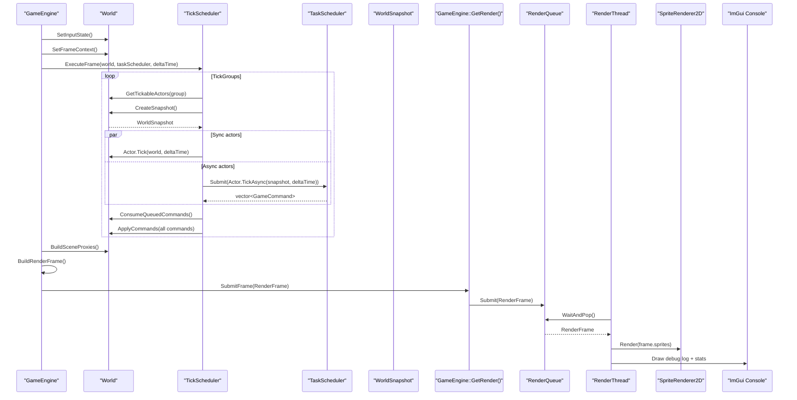

# MiniEngine2D Frame Flow

```mermaid
sequenceDiagram
    participant GE as "GameEngine"
    participant W as "World"
    participant TS as "TickScheduler"
    participant AS as "TaskScheduler"
    participant WS as "WorldSnapshot"
    participant GR as "GameEngine::GetRender()"
    participant RQ as "RenderQueue"
    participant RT as "RenderThread"
    participant SR as "SpriteRenderer2D"
    participant IG as "ImGui Console"

    GE->>W: SetInputState()
    GE->>W: SetFrameContext()

    GE->>TS: ExecuteFrame(world, taskScheduler, deltaTime)

    loop TickGroups
        TS->>W: GetTickableActors(group)
        TS->>W: CreateSnapshot()
        W-->>TS: WorldSnapshot

        par Sync actors
            TS->>W: Actor.Tick(world, deltaTime)
        and Async actors
            TS->>AS: Submit(Actor.TickAsync(snapshot, deltaTime))
            AS-->>TS: vector<GameCommand>
        end

        TS->>W: ConsumeQueuedCommands()
        TS->>W: ApplyCommands(all commands)
    end

    GE->>W: BuildSceneProxies()
    GE->>GE: BuildRenderFrame()
    GE->>GR: SubmitFrame(RenderFrame)
    GR->>RQ: Submit(RenderFrame)

    RT->>RQ: WaitAndPop()
    RQ-->>RT: RenderFrame
    RT->>SR: Render(frame.sprites)
    RT->>IG: Draw debug log + stats
```
