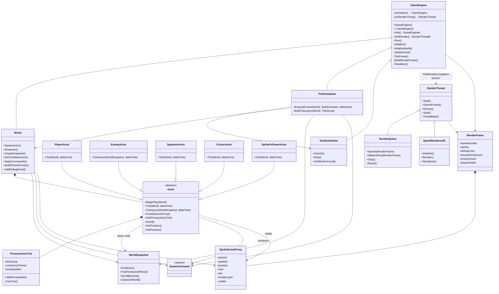

# MiniEngine2D Class UML

```mermaid
classDiagram
    class GameEngine {
        +GameEngine()
        +~GameEngine()
        +Get() GameEngine&
        +GetRender() RenderThread&
        +Run()
        -Initialize()
        -InitializeWorld()
        -UpdateInput()
        -TickFrame()
        -BuildRenderFrame()
        -Shutdown()
        -ourInstance_ : GameEngine*
        -ourRenderThread_ : RenderThread
    }

    class World {
        +SpawnActor()
        +FindActor()
        +CreateSnapshot()
        +GetTickableActors()
        +ApplyCommands()
        +BuildSceneProxies()
        +AddDebugEvent()
    }

    class Actor {
        <<abstract>>
        +BeginPlay(World)
        +Tick(World, deltaTime)
        +TickAsync(WorldSnapshot, deltaTime)
        +CreateSceneProxy()
        +GetPrimaryActorTick()
        +GetId()
        +GetPosition()
        +SetPosition()
    }

    class PlayerActor {
        +Tick(World, deltaTime)
    }

    class EnemyActor {
        +TickAsync(WorldSnapshot, deltaTime)
    }

    class SpawnerActor {
        +Tick(World, deltaTime)
    }

    class CursorActor {
        +Tick(World, deltaTime)
    }

    class SpriteFollowerActor {
        +Tick(World, deltaTime)
    }

    class PrimaryActorTick {
        +tickGroup
        +runOnAnyThread
        +prerequisites
        +AddPrerequisite()
        +CanTick()
    }

    class TickScheduler {
        +ExecuteFrame(World, TaskScheduler, deltaTime)
        -BuildTickLayers(World, TickGroup)
    }

    class TaskScheduler {
        +Submit()
        +Stop()
        +GetWorkerCount()
    }

    class WorldSnapshot {
        +FindActor()
        +FindFirstActorOfKind()
        +IsCellBlocked()
        +ClampToWorld()
    }

    class GameCommand {
        <<variant>>
    }

    class RenderFrame {
        +frameNumber
        +sprites
        +debugLines
        +framesPerSecond
        +enemyCount
        +playerHealth
    }

    class SpriteSceneProxy {
        +actorId
        +spriteId
        +position
        +size
        +tint
        +renderLayer
        +visible
    }

    class RenderQueue {
        +Submit(RenderFrame)
        +WaitAndPop(RenderFrame)
        +Stop()
        +Reset()
    }

    class RenderThread {
        +Start()
        +SubmitFrame()
        +Resize()
        +Stop()
        -ThreadMain()
    }

    class SpriteRenderer2D {
        +Initialize()
        +Render()
        +Shutdown()
    }

    GameEngine o-- World
    GameEngine o-- TickScheduler
    GameEngine o-- TaskScheduler
    GameEngine ..> RenderThread : "GetRender() singleton access"

    World *-- Actor
    Actor *-- PrimaryActorTick

    PlayerActor --|> Actor
    EnemyActor --|> Actor
    SpawnerActor --|> Actor
    CursorActor --|> Actor
    SpriteFollowerActor --|> Actor

    TickScheduler --> World
    TickScheduler --> TaskScheduler
    TickScheduler --> WorldSnapshot
    TickScheduler --> GameCommand

    Actor --> WorldSnapshot : async read
    Actor --> GameCommand : produces
    Actor --> SpriteSceneProxy : builds

    World --> WorldSnapshot
    World --> GameCommand
    World --> SpriteSceneProxy

    GameEngine --> RenderFrame
    RenderFrame *-- SpriteSceneProxy

    RenderThread o-- RenderQueue
    RenderThread o-- SpriteRenderer2D
    RenderThread --> RenderFrame
```
